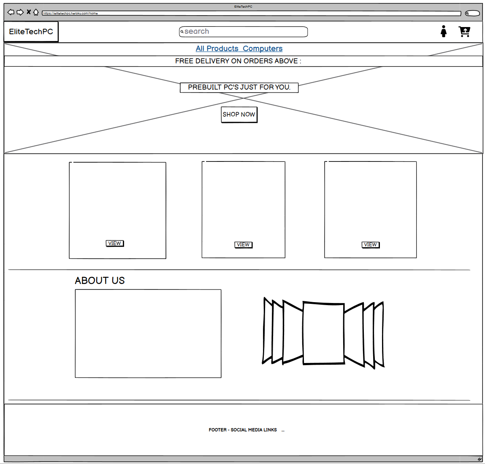
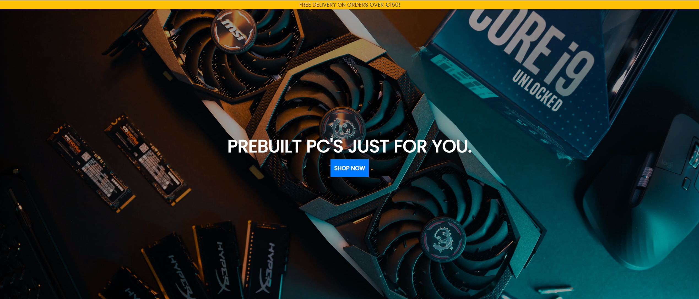
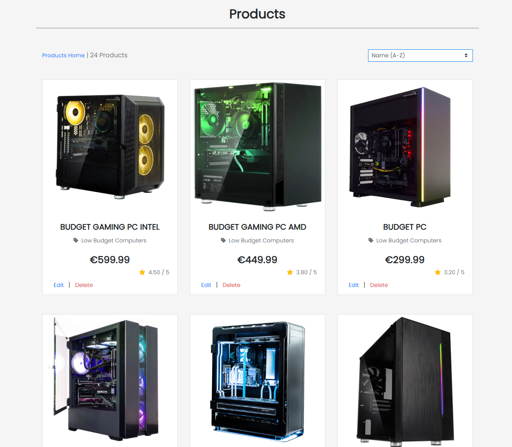
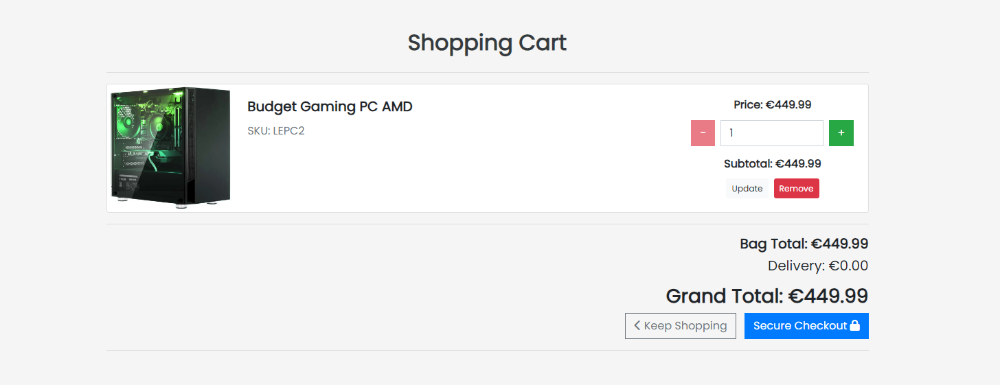
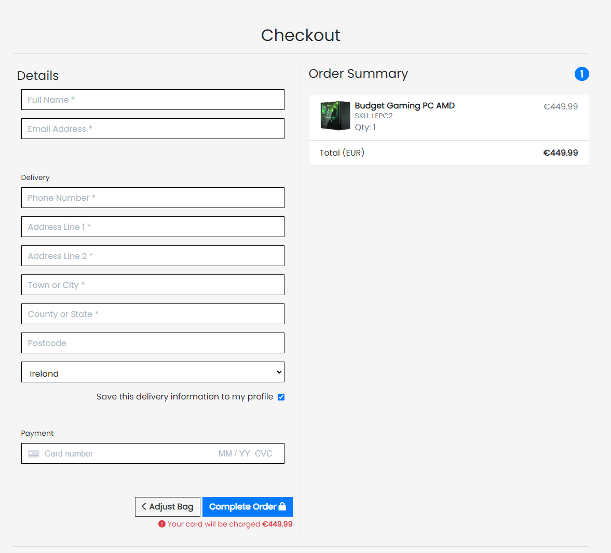
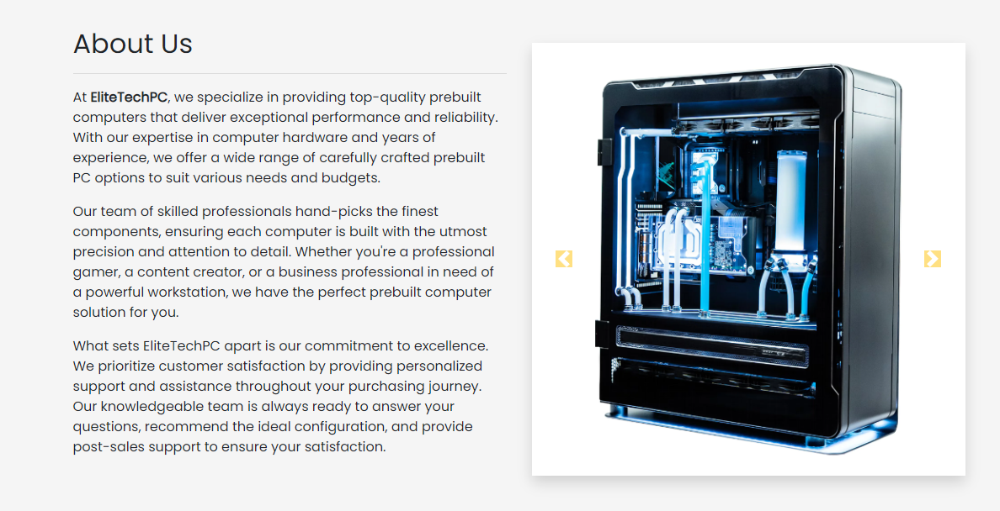
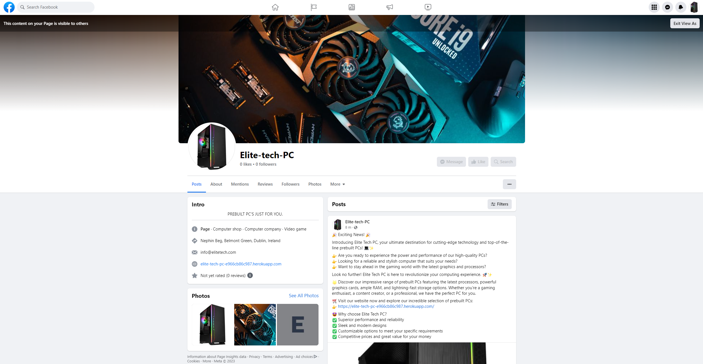

# EliteTechPC - Prebuilt PC STORE #

* Here I have created EliteTechPC - Prebuilt Computers which is a B2C e-commerce site. The site allows the users to have a look around for their next potential home office pc, a workstation for heavy duty work or even a high performance gaming machine. There is loads of features currently implemented into the website with more to come.
Registered users gain access to My Profile which lets them update their delivery information and track their orders.

The live version of the website is available for you here : <a href="https://elite-tech-pc-e966cb86c987.herokuapp.com/">EliteTechPC</a>

# README CONTENTS # 

* ## [UX](#ux-1)
   * [User Stories](#user-stories)
   * [Agile Methodologies](#agile-methodologies)
   * [The Scope](#1-scope)
   * [Structure](#2-structure)
   * [Skeleton](#3-skeleton)
   * [Surface](#4-surface)

* ## [Testing](#testing-1)
    *

   

* ## [Deployment](#deployment-1)

* ## [Technologies Used](#)

    * [Languages Used](#languages)
    * [Frameworks / Libraries](#frameworks--libraries--programs)

* ## [Credits](#credits-1)

# UX #

## User Stories ##

  * Site Owner Goals : 
  
    * Create a visually appealing and professional website design to attract users
    * Implement a user-friendly and intuitive interface for easy navigation
    * Enable user account management and access control
    * Provide tools for managing and moderating user-generated content
    * Develop a responsive design that works seamlessly on various devices
    * Establish effective communication channels to interact with users and offer support.

  * User Goals : 

    * Allow users to create accounts and have control over their information
    * Provide a straightforward and efficient browsing experience for content discovery
    * Delivery a responsive and user-friendly design that functions well on all devices
    * The ability to add/edit/remove/update items in the shopping cart

By addressing these goals, EliteTechPC aims to create a compelling and user-centric experience for both the site owner and the users, satisfaction and a seamless interaction with the platform.

    

# Agile Methodologies #

The Agile Methodology approach was adopted during the development of the EliteTechPC - E-Commerce Prebuilt PC store. I have utilized GitHub's built-in features such as issue tracking and project management to effectively manage tasks and monitor progress.

User stories were categorized into "Must-Have" and "Could-Add" features to prioritize the development process. This allowed for systematic approach to implementing essential functionalities while leaving room for future enhancements.

While the application is still a work in progress, it is continuously evolving with a focus on delivering a fully functional and feature-rich online store for users to explore. I remain dedicated to expanding the platforms capabilities and provide an exceptional shopping experience for customers.

# 1. Scope # 

EliteTechPC is an E-Commerce website offering a wide range of prebuilt computers. The scope of this project is to develop a fully functional and user-friendly online store that allows customers to browse, purchase, and manage their orders seamlessly.

# 2. Structure #

* Features and Functionality :
    * User Registration and Authentication :
        * User registration and login functionality for customers to create and manage their accounts.
        * User authentication and access control to ensure secure and personalized experiences.
    * Product Catalog :
        * Display a comprehensive catalog of prebuilt computers.
        * Categorize products based on different criteria such as, prize, name , ratings etc.
        * Provide detailed product information, including specifications, images and ratings.
    * Shopping Cart and Checkout :
        * Enable customers to add products to their shopping cart and manage quantities.
        * Implement a secure and intuitive checkout process, including address and payment information collection.
        * Integration with payment gateway to facilitate secure online transactions (Stripe).
    * Order Management :
        * Allow users to view and track their order history, including the order number, date, total cost and item.
    * Search and Filtering :
        * Implement a search functionality to allow customers to find products based on keywords or specific criteria
        * Enable filtering options to refine product search results based on various attributes.
    * Responsive Design :
        * Develop a responsive website that provides optimal user experience across different devices and screen sizes.
        * Ensure seamless navigation and readability on desktops, tablets and mobile devices.
    * Admin Panel :
        * Implement an admin panel for site administrators to manage products, orders and user accounts.
        * Enable inventory management, including stock updates and product additions or removals.
    * Profile Page :
        * Implement a user profile page to update their delivery information for future purchases and track orders.
    

# 3. Skeleton #

Here is a basic wireframe of the website's layout. This is the initial template I have started off with and worked my way around the other templates with this design: 
    

Here is the Database Schema for the project : 

# 4. Surface # 

## Colors ##

Here's the primary pallete of colors I have used throughout this project.
These are vibrant colors that I think offset each other really and work together. 

## Layout ##

The layout of the EliteTechPC website is designed to be responsive and user-friendly across various devices thanks to Bootstrap! The website utilizes the Bootstrap framework to ensure a consistent and visually appealing experience. The layout elements are :

1. Header:
    * The header section is sticky to the top of the screen, providing easy navigation and access to essential features wherever you may be on the page.
    * The EliteTechPC logo is prominently displayed, along with navigation links to different sections of the website.
    * The header also includes additional elements such as a search barm user account options and a shopping cart.

    

2. Hero Section:
    * The Hero section showcases a visually appealing image related to the computer hardware for PC's 
    * It features a compelling headline and a call-to-action button to encourage users to start to explore the products the website has to offer.

    

3. Product Display:
    * Products are presented in a grid format, allowing users to browse through different categories and options.
    * Each product listing includes key information such as product name, image, price and rating.
    * Users can click on a product to view more details including specifications and a quantity input for however amount of items they desire.

    

4. Shopping Cart and Checkout:
    * A user friendly shopping cart interface allows customers to add products, adjust quantities and proceed to checkout.
    * The checkout process includes collecting necessary information like shipping address and payment details.
    * Users are guided through the steps and provided with clear instructions to complete their purchase securely.

    
    

5. Content Cards: 
    * Content cards are utilized throughout the website to present various information such as featured products, categories etc.

    
    

6. Footer:
    * The footer section appears at the bottom of the page , featuring essential site information such as contact details and links to important pages.

    

Overall, EliteTechPC website layout aims to provide a visually appealing and intuitive user interface, ensuring that users can easily navigate, explore and engage with the range of prebuilt computers offered by the store.

# E-Commerce Model #

EliteTechPC is an e-commerce platform that specializes in selling high-quality prebuilt PCs to consumers. Our mission is to provide customers with the top-of-the-line computer systems that deliver exceptional performance, reliability and value. Target market includes both gaming enthusiasts and professionals in need of high-performance machines. We cater to individuals who value superior hardware components, seamless functionality and latest advancements in technology.
This is a Business to Consumer model and it is catered to be as simple yet intuitive for the consumer along with the sign-ups to the newsletter with potential deals and more.

# Social Media #

## Marketing ## 

Here I have made a Social Media Marketing Page for the EliteTechPC store. It is a fantastic way to boost and increase engaement within the business and in increasing sales. Here is the screenshot of the whole page available to anyone.

## Newsletter ##

I have also included into the website a Mailchimp service that handles the newsletter automation for customers. It would contain any deals , special offers, new products and more. Anyone can sign up hassle-free by entering their email address in the input box provided.

# Testing # 

    Details for all the testing done through the project are in here.

 * I have created a seperate markdown documentation for the testing of this project. 

 - You can view the testing here : [Testing.MD](./TESTING.md)

# Deployment #

    Describe the Full Deployment Cycle for the Project Here. 
    Followed by a Deployed Site Link

* You can find the deployed version of the website here : <a href="" target="_blank">EliteTechPC</a>

# Technologies Used #

* ## Languages ##
  * HTML
  * CSS
  * Python
  * JavaScript

* ## Frameworks / Libraries / Programs ##
  * <a href="https://www.djangoproject.com/">Django (Python web Framework)</a> 
  * <a href="https://jquery.com/">jQuery (Javascript Library)</a>
  * <a href="https://getbootstrap.com/">Bootstrap (Front-End Library)</a>
  * <a href="https://django-crispy-forms.readthedocs.io/en/latest/">Django-Crispy-Forms (Django Form Rendering Library)</a>
  * <a href="https://pypi.org/project/psycopg2/">Psycopg2-Binary(PostgreSQL database adapter for Python)</a>
  * <a href="https://balsamiq.com/wireframes/?gclid=CjwKCAjw0N6hBhAUEiwAXab-TS4-B3FwE_NpeSWRL6jqqSJMnuxinyknl1t_ddtaW_Jd3UAOvbxguhoC4agQAvD_BwE">Balsamiq Wireframes(Wireframe Software to sketch initial design)</a>
  * <a href="https://github.com/">GitHub (Version Control alongside a Local Development Enviroment)</a>
  * <a href="https://fontawesome.com/">Font Awesome (Library of Icons)</a>
  * <a href="https://www.elephantsql.com/">ElephantSQL (Hosting service for the database for this application)</a>
  * <a href="https://aws.amazon.com/">AWS Amazon Hosting Service</a>
  * <a href="https://heroku.com/">Heroku (Application hosting service)</a>
  * <a href="https://www.lucidchart.com/pages/">Lucidchart (Online Application for Flowcharts/Diagrams)</a>

# Credits #

### Coding ###

* <a href="https://google.com">Google</a>
* <a href="https://ui.dev/amiresponsive">AMI Responsive</a>
* <a href="https://stackoverflow.com/">Stack Overflow</a>
* <a href="https://youtube.com">YouTube</a>
* <a href="https://w3schools.com">W3Schools</a>
* <a href="https://https://codeinstitute.net/">Code Institute</a>
* <a href="https://getbootstrap.com/docs/5.3/getting-started/introduction/">Boostrap Documentations</a>

All those resources were very valuable in the progression of my project whenever I was stuck at any point in time I refered back to the course material as well as the online resources.

    All my images were sourced from google images,
    and any copyrights are reserved for the owners as these are 
    just for display purposes only.

    I would especially like to thank you to Code Institute
    for supplying me with the necessary guidance for this project. 
    I have went along the walkthrough projects and also used 
    the full Gitpod template provided by them , 
    which in all they have helped tremendously.

[Back To Top Link]